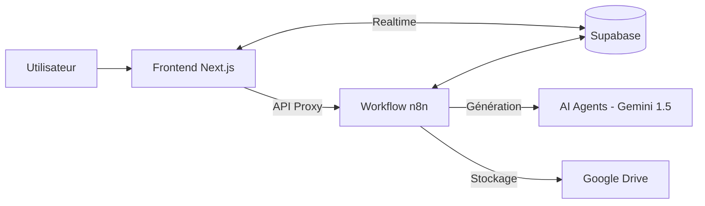

# 📚 Documentation Globale : Content Factory by Calebasse

Cette documentation détaille l'architecture, le fonctionnement technique et les processus métiers de la plateforme **Content Factory**.

---

## 🏗️ 1. Architecture Globale

La solution repose sur un triptyque technologique moderne :

1.  **Frontend (Next.js 15)** : Interface utilisateur performante, réactive et optimisée (Shadcn/UI, TailwindCSS).
2.  **Base de données (Supabase)** : Stockage des articles, des métadonnées, de la configuration et gestion Temps Réel (Realtime).
3.  **Moteur d'exécution (n8n)** : Orchestration des agents IA via un workflow asynchrone complexe.

---

## 🤖 2. Les Agents IA (Workflow n8n)

Le workflow n8n utilise une architecture "Multi-Agents" pour garantir une qualité optimale :

| Agent | Rôle | Outils / Actions |
| :--- | :--- | :--- |
| **Chercheur** | Extraction de connaissances | Firecrawl (Web Scraping), Recherche Google. |
| **Planificateur** | Structuration | Génération de la Table des Matières (TOC) en JSON. |
| **Rédacteur** | Création de contenu | Rédaction Markdown basée sur les recherches et le plan. |
| **Optimiseur** | Raffinement | Amélioration SEO, style et correction orthographique. |
| **Évaluateur** | Contrôle Qualité | Scoring sur 100 (SEO, Clarté, Véracité, Structure). |

### Le Cycle de Vie d'un Article :
1.  **Soumission** : L'utilisateur envoie un prompt et des paramètres (ton, langue, longueur).
2.  **Recherche & Plan** : Les agents extraient les infos et proposent une TOC.
3.  **Validation (Pause)** : Le processus s'arrête. L'utilisateur valide ou modifie la TOC sur le Dashboard.
4.  **Rédaction & Boucle de Qualité** : L'article est rédigé, puis évalué. Si le score est < 80/100, une boucle de ré-écriture automatique est lancée (max 3 essais).
5.  **Finalisation** : L'article est uploadé sur Google Drive et marqué comme "Terminé".

---

## 💾 3. Modèle de Données (Supabase)

La table principale `articles` contient :
- **Métadonnées** : `topic`, `language`, `tone`, `target_length`.
- **Contenu** : `content` (Markdown), `search_synthesis` (JSON), `table_of_contents` (JSON).
- **Suivi** : `status` (draft, processing, waiting_validation, done), `score`, `drive_link`.
- **Consommation** : `token_usage` (Consommation réelle d'IA par étape).

---

## ⚙️ 4. Intégration & Sécurité

### Proxy API (Next.js)
Pour éviter les problèmes de CORS et sécuriser les URLs de webhooks n8n, les requêtes passent par une route API interne (`/api/n8n`). Cette route utilise des variables d'environnement (`.env.local`) pour communiquer de manière invisible avec le serveur n8n.

### Realtime (Temps Réel)
La plateforme utilise les fonctionnalités Realtime de Supabase. Dès que n8n met à jour une colonne (un nouveau score ou un changement de statut), l'interface utilisateur se rafraîchit instantanément sans recharger la page.

---

## 📈 5. Monitoring & Consommation

L'onglet **Paramètres > Consommation** permet de suivre :
- Les jetons (tokens) utilisés par chaque étape (Recherche, Rédaction, Évaluation).
- Le coût estimé et l'efficacité des agents.

---

## 🚀 6. Déploiement

- **Frontend** : Déployable sur Vercel.
- **Backend Agents** : Instance n8n (self-hosted ou cloud).
- **Database** : Instance Supabase Cloud.

---

> [!TIP]
> **Le secret de la qualité** réside dans l'agent Évaluateur. C'est lui qui garantit que l'article final respecte non seulement vos consignes, mais aussi les standards de lecture web modernes.

# Content_Factory
