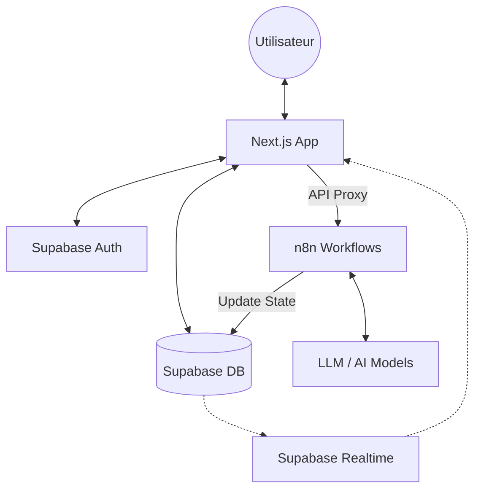

# 🏗 Architecture Technique

Ce document détaille l'architecture globale de la plateforme **Content Factory Calebasse**.

## 1. Vue d'Ensemble

L'application suit une architecture **Serverless / Hybrid Cloud** :
- **Client & Proxy** : Next.js 16 (Vercel/Netlify).
- **Backend as a Service (BaaS)** : Supabase (Auth, DB, Realtime).
- **Automatisme & Workflow** : n8n (AI Agents orchestration).

## 2. Choix Technologiques

### Frontend
- **Framework** : Next.js 16 avec **App Router**. Optimise le rendu côté serveur (SSR) et la navigation fluide.
- **UI System** : Tailwind CSS v4. Utilise une approche utilitaire pure avec des variables CSS modernes.
- **Composants** : Shadcn/UI pour une base accessible et hautement personnalisable.
- **Animations** : Framer Motion pour les transitions fluides (ex: barres de progression, loaders).

### Automatisation IA (n8n)
L'intelligence de l'application n'est pas codée en dur dans le frontend. Elle est déportée dans **n8n** pour :
- **Flexibilité** : Modifier le prompt ou le modèle d'IA sans redéployer le frontend.
- **Multi-Agents** : Gérer des tâches complexes (recherche, rédaction, synthèse, vérification) en parallèle.

## 3. Flux de Données (Data Flow)

1.  **Init** : L'utilisateur remplit le formulaire dans `/create`.
2.  **Trigger** : Le frontend appelle l'API Interne `/api/n8n`.
3.  **Proxy** : La route API transmet la requête à l'instance n8n masquant ainsi l'URL cible.
4.  **Processing** : n8n crée l'enregistrement initial dans Supabase et commence le travail.
5.  **Sync** : À chaque étape majeure, n8n met à jour la colonne `status` ou `content` dans la table `articles`.
6.  **Realtime** : Le composant `ArticlePage` écoute via un canal Supabase Realtime et met à jour l'UI instantanément lors des changements de n8n.

## 4. Performance & Optimisation

- **Images** : Optimisées via `next/image` pour le Lazy Loading.
- **Polices** : Chargées localement via `next/font` pour éviter le CLS (Cumulative Layout Shift).
- **Streaming** : Bien que l'IA ne supporte pas toujours le streaming natif HTTP, nous simulons l'effet via des mises à jour granulaires en base de données captées par Realtime.
